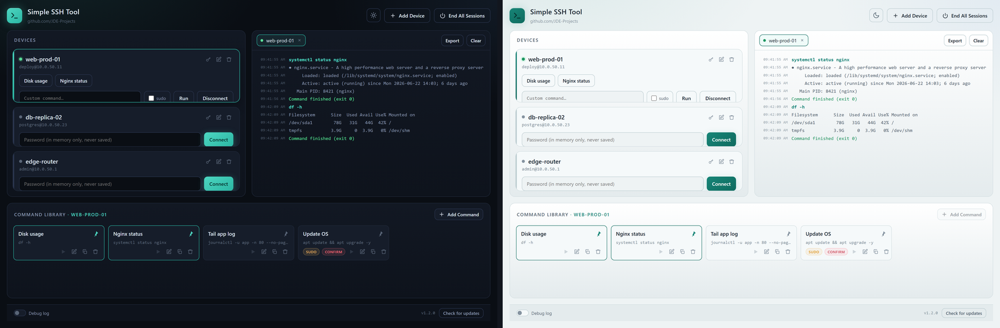

# Simple SSH Tool

A small, standalone Windows desktop tool to connect to your machines over SSH and run your own saved commands or one-off custom commands, with live output. Add a device, type the password when you connect, and use one-tap command buttons or a free command box. The interface is a clean web-style window.

Built by [JDE-Projects](https://github.com/JDE-Projects).

If you enjoyed this project and would like to buy me a coffee, check out my [Ko-fi](https://ko-fi.com/jdeprojects).

## Preview

<p align="center">
  
  <br><em>Dark and light themes</em>
</p>

## Highlights

- **Per-device command library.** Build named commands for each device, mark some with sudo or a confirm prompt, pin up to 10 as quick buttons, and copy a command to another saved device.
- **Secrets are never saved.** The SSH password is held in memory only and wiped on disconnect. Only the name, host, username, and saved commands are written to `devices.json`.
- **Multiple connections at once.** Up to five devices connect independently, each with its own console tab.
- **Tabbed console with export.** Timestamped, per-device output. Export the active tab to a text file next to the app, and clear it for a fresh view.
- **Optional debug log.** A toggle in the bottom left writes a timestamped log next to the app for the session. Off by default, and passwords are never written to it.
- **Update check.** The version button checks GitHub Releases and points you to a newer build when one exists.

## How it works

- Backend: [Paramiko](https://www.paramiko.org/) for SSH, running each command on its own channel and streaming output line by line.
- Window: pywebview on the Qt backend (PySide6), with the UI in `simple_ssh_tool-UI.html`. Fonts are bundled in `fonts/`, so the look holds with no internet.
- `devices.json` is portable: it carries a small header with the project URL, so you can back it up or move it to another machine. Older config files migrate automatically on first load.

## Download and run

Two ways to get it from the [Releases](../../releases) page - pick one:

- **Installer (recommended):** download `SimpleSSHTool-vX.Y.Z-setup.exe` and run it. Installs the app, adds a Start menu shortcut, and can be removed later from Add or Remove Programs. Installs just for you by default (no admin); you can choose all users during setup.
- **Portable .zip:** download `SimpleSSHTool-vX.Y.Z.zip`, extract it, and run `Simple SSH Tool.exe` from inside the extracted folder. No install - good for a locked-down PC or a USB stick. Keep the folder together.

Windows only, no Python or setup required. Unsigned, so SmartScreen may warn the first time: **More info > Run anyway**.

## Updating

Simple SSH Tool doesn't update itself. The bottom bar has a **Check for updates** button that tells you when a newer release is out; when it does, get the new version from the [Releases](../../releases) page the same way you first installed it.

- **Installer:** download the new `SimpleSSHTool-vX.Y.Z-setup.exe` and run it. It installs over your current copy and keeps your saved devices and theme choice.
- **Portable .zip:** download and extract the new `SimpleSSHTool-vX.Y.Z.zip`. To keep your saved devices, copy `devices.json`, `known_hosts`, and the theme `.pref` file (if present) from the old folder into the new one.

Your SSH passwords are never stored, so there's nothing else to carry over.

## Verify this download (optional)

This release was built on GitHub from this public source, not on a personal
machine, and is signed with a build-provenance attestation. To confirm your
download is genuine, install the [GitHub CLI](https://cli.github.com) and run:

```
gh attestation verify SimpleSSHTool-vX.Y.Z.zip \
  --repo JDE-Projects/Simple-SSH-Tool \
  --signer-repo JDE-Projects/Build-Tools
```

A `Verification succeeded!` line means the file was built by the published
pipeline from this repo. You can also check the file against the published
`.sha256`.

## Build from source (optional)

If you would rather run or build it yourself, you need:

- **Python 3** on the machine's PATH.
- Python packages, pinned in `requirements.txt` (`pywebview`, `PySide6`, `paramiko`, plus Paramiko's crypto deps and PyInstaller). Keep `PyQt6` uninstalled so PySide6 is the binding that gets bundled.

```
pip install -r requirements.txt
```

Keep these together so the app finds them next to itself: `simple_ssh_tool.py`, `simple_ssh_tool-UI.html`, the `fonts/` folder, `simple_ssh_tool.ico`, `simple_ssh_tool.png`, and `simple_ssh_tool-splash.png`. Then either:

- **Run from source:** `python simple_ssh_tool.py`
- **Build the .exe:** double-click `Build_Simple_SSH_Tool.bat`, which uses PyInstaller to produce `dist\Simple SSH Tool\Simple SSH Tool.exe` (a folder). Distribute the whole `dist\Simple SSH Tool` folder, zipped. The splash shows while the app starts.

## Using it

1. Click **Add Device**, give it a display name, then enter the host or IP and the username.
2. On the device card, type the password and click **Connect**. A console tab opens for it.
3. Manage that device's commands in the **Command Library** pane along the bottom: add, edit, delete, pin, and copy to another device. Pinned commands appear as quick buttons on the card.
4. Run a saved command, a pin, or type one in the custom box (toggle **sudo** if it needs root). Commands with a confirm message ask before firing.
5. **Export** saves the active tab's console to a text file next to the app. **Disconnect** asks first, then clears the password from memory; closing a tab can disconnect too.

## Notes

- Saved commands are per device, so a Linux box and a switch each keep only the commands that make sense for them.
- Over SSH there is no interactive prompt for sudo, so the sudo toggle feeds your password to the command for you. Type a plain command and flip the toggle rather than prefixing `sudo` yourself.
- The tool accepts the host key on first connection. Use it on networks you control.

## Security and privacy

- The SSH password is never written to disk.
- `devices.json` holds only the name, host, username, and your saved commands. Keep it out of source control, since it maps your internal hosts and accounts.
- The debug log, when enabled, redacts the password before writing.

## A note on how this was built

This project was built with AI assistance. The design decisions, feature direction, and real-world testing were directed by me. The code was written and revised with an AI assistant against that direction. Treat it like any community tool: review and test it before relying on it.

## License

Released under the [PolyForm Noncommercial License 1.0.0](LICENSE): personal and noncommercial use, modification, and noncommercial redistribution are permitted; commercial use is not. Keep the copyright notice; no warranty. The tool bundles third-party code (PySide6/Qt and Paramiko, both LGPL) and fonts; their notices are in [THIRD-PARTY-LICENSES.txt](THIRD-PARTY-LICENSES.txt).

For commercial licensing, open a [GitHub issue](https://github.com/JDE-Projects/Simple-SSH-Tool/issues) with the title "Commercial License Inquiry".
